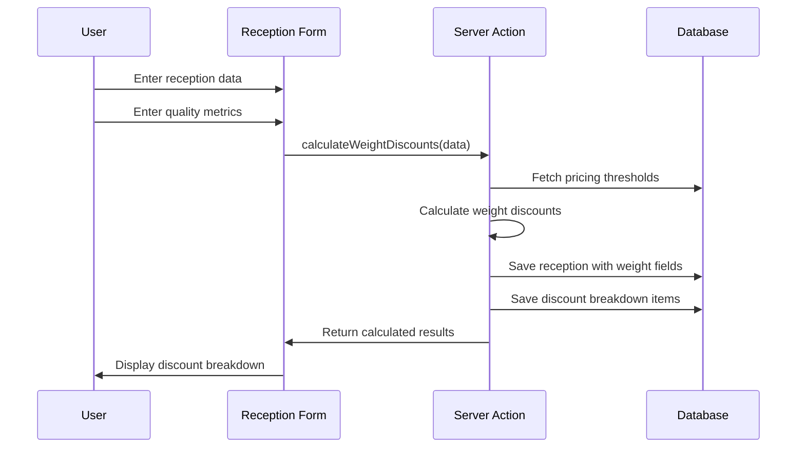

# Data Model Design: Weighted Discount Calculation and Visualization

**Date**: 2025-10-31
**Feature**: Weighted Discount Calculation and Visualization in Receptions

## Database Schema Extensions

### 1. Extended Receptions Table

Add weight discount columns to existing `receptions` table:

```sql
ALTER TABLE receptions
ADD COLUMN total_peso_original DECIMAL(10,2) DEFAULT 0,
ADD COLUMN total_peso_descuento DECIMAL(10,2) DEFAULT 0,
ADD COLUMN total_peso_final DECIMAL(10,2) DEFAULT 0;
```

**Column Definitions**:
- **total_peso_original**: Weight before applying any discounts (kg)
- **total_peso_descuento**: Total weight subtracted due to discounts (kg)
- **total_peso_final**: Final weight after all discounts applied (kg)

### 2. New Discount Breakdown Table

```sql
CREATE TABLE desglose_descuentos (
  id UUID PRIMARY KEY DEFAULT gen_random_uuid(),
  recepcion_id UUID NOT NULL REFERENCES receptions(id) ON DELETE CASCADE,
  parametro VARCHAR(50) NOT NULL, -- e.g., "Moho", "Humedad", "Violetas"
  umbral DECIMAL(5,2) NOT NULL,   -- Threshold value (e.g., 10.00)
  valor DECIMAL(5,2) NOT NULL,    -- Actual quality value (e.g., 12.50)
  porcentaje_descuento DECIMAL(5,2) NOT NULL, -- Discount percentage (e.g., 5.00)
  peso_descuento DECIMAL(10,2) NOT NULL,      -- Weight reduction (kg)
  created_at TIMESTAMPTZ NOT NULL DEFAULT NOW(),
  created_by UUID NOT NULL REFERENCES users(id),

  CONSTRAINT unique_recepcion_parametro UNIQUE(recepcion_id, parametro)
);
```

**Table Relationships**:
- One-to-many: `receptions` → `desglose_descuentos`
- Each reception can have multiple discount breakdown items
- Unique constraint prevents duplicate parameters per reception

### 3. Extended Pricing Calculations

Update `pricing_calculations.calculation_data` JSONB structure:

```json
{
  "quality_metrics": [
    {
      "metric": "Moho",
      "value": 12.5,
      "threshold": 10.0,
      "discount_percentage": 5.0,
      "discount_amount": 34.30
    }
  ],
  "weight_discounts": [
    {
      "metric": "Moho",
      "original_weight": 686.00,
      "discount_percentage": 5.0,
      "weight_reduction": 34.30,
      "final_weight": 651.70
    }
  ],
  "summary": {
    "total_original_weight": 686.00,
    "total_weight_discount": 34.30,
    "total_final_weight": 651.70,
    "total_discount_percentage": 5.0
  }
}
```

## Entity Relationships

### Core Entities

#### Reception (Extended)
```typescript
interface Reception {
  id: UUID;
  reception_number: string;
  provider_id: UUID;
  driver_id: UUID;
  fruit_type_id: UUID;
  truck_plate: string;
  total_containers: number;

  // Weight discount fields (NEW)
  total_peso_original: number;     // Before discounts
  total_peso_descuento: number;    // Total discount amount
  total_peso_final: number;        // After discounts

  // Existing fields
  reception_date: Date;
  reception_time: string;
  status: 'draft' | 'completed' | 'cancelled';
  notes: string;

  // Relationships
  pricing_calculation_id?: UUID;
  created_by: UUID;
  created_at: Date;
  updated_at: Date;
}
```

#### Discount Breakdown Item (NEW)
```typescript
interface DiscountBreakdown {
  id: UUID;
  recepcion_id: UUID;
  parametro: string;               // "Moho", "Humedad", "Violetas"
  umbral: number;                  // Threshold value
  valor: number;                   // Actual quality value
  porcentaje_descuento: number;   // Discount percentage
  peso_descuento: number;          // Weight reduction amount

  created_by: UUID;
  created_at: Date;
}
```

#### Quality Evaluation (Existing)
```typescript
interface CalidadCafe {
  id: UUID;
  recepcion_id: UUID;
  violetas: number;    // 0-100 percentage
  humedad: number;     // 0-100 percentage
  moho: number;        // 0-100 percentage

  created_by: UUID;
  updated_by: UUID;
  created_at: Date;
  updated_at: Date;
}
```

#### Pricing Threshold (Existing)
```typescript
interface DiscountThreshold {
  id: UUID;
  pricing_rule_id: UUID;
  quality_metric: 'Violetas' | 'Humedad' | 'Moho';
  min_value: number;
  max_value: number;
  discount_percentage: number;   // Applied to weight

  created_by: UUID;
  updated_by: UUID;
  created_at: Date;
  updated_at: Date;
}
```

## Data Flow Architecture

### 1. Reception Creation Flow



### 2. Discount Calculation Logic

```typescript
function calculateWeightDiscounts(
  totalWeight: number,
  qualityData: CalidadCafe,
  thresholds: DiscountThreshold[]
): WeightDiscountResult {

  let totalDiscount = 0;
  const breakdowns: DiscountBreakdown[] = [];

  // For each quality metric
  for (const metric of ['moho', 'humedad', 'violetas']) {
    const value = qualityData[metric];
    const applicableThreshold = findThreshold(thresholds, metric, value);

    if (applicableThreshold) {
      const weightDiscount = totalWeight * (applicableThreshold.discount_percentage / 100);
      totalDiscount += weightDiscount;

      breakdowns.push({
        parametro: metric.charAt(0).toUpperCase() + metric.slice(1),
        umbral: applicableThreshold.min_value,
        valor: value,
        porcentaje_descuento: applicableThreshold.discount_percentage,
        peso_descuento: weightDiscount
      });
    }
  }

  return {
    original_weight: totalWeight,
    total_discount: totalDiscount,
    final_weight: totalWeight - totalDiscount,
    breakdowns
  };
}
```

### 3. Form State Integration

```typescript
// Extended form state
const [formData, setFormData] = useState({
  // ... existing fields
  total_peso_original: 0,
  total_peso_descuento: 0,
  total_peso_final: 0,
});

const [discountBreakdown, setDiscountBreakdown] = useState<DiscountBreakdown[]>([]);

// Real-time calculation
const calculateDiscounts = useCallback(async (qualityData: QualityData) => {
  if (!formData.fruit_type_id || !totalWeight) return;

  const result = await calculateWeightDiscounts(totalWeight, qualityData, fruitType);

  setFormData(prev => ({
    ...prev,
    total_peso_original: result.original_weight,
    total_peso_descuento: result.total_discount,
    total_peso_final: result.final_weight
  }));

  setDiscountBreakdown(result.breakdowns);
}, [formData.fruit_type_id, totalWeight]);
```

## Validation Rules

### Database Constraints
```sql
-- Reception weight fields constraints
ALTER TABLE receptions
ADD CONSTRAINT chk_peso_original_nonnegative CHECK (total_peso_original >= 0),
ADD CONSTRAINT chk_peso_descuento_nonnegative CHECK (total_peso_descuento >= 0),
ADD CONSTRAINT chk_peso_final_nonnegative CHECK (total_peso_final >= 0),
ADD CONSTRAINT chk_peso_calculation CHECK (
  total_peso_final = total_peso_original - total_peso_descuento
);

-- Discount breakdown constraints
ALTER TABLE desglose_descuentos
ADD CONSTRAINT chk_descuento_porcentaje_rango CHECK (
  porcentaje_descuento >= 0 AND porcentaje_descuento <= 100
),
ADD CONSTRAINT chk_peso_descuento_nonnegative CHECK (peso_descuento >= 0);
```

### Application Validation
```typescript
// Zod schemas for runtime validation
const WeightDiscountSchema = z.object({
  total_peso_original: z.number().min(0, "El peso original debe ser positivo"),
  total_peso_descuento: z.number().min(0, "El descuento no puede ser negativo"),
  total_peso_final: z.number().min(0, "El peso final debe ser positivo"),
}).refine(
  (data) => Math.abs(data.total_peso_final - (data.total_peso_original - data.total_peso_descuento)) < 0.01,
  {
    message: "La suma de peso original y descuento debe igualar el peso final",
    path: ["total_peso_final"]
  }
);

const DiscountBreakdownSchema = z.object({
  parametro: z.enum(["Moho", "Humedad", "Violetas"]),
  umbral: z.number().min(0).max(100),
  valor: z.number().min(0).max(100),
  porcentaje_descuento: z.number().min(0).max(100),
  peso_descuento: z.number().min(0),
});
```

## Security Considerations

### Row Level Security (RLS)
```sql
-- Discount breakdown access control
CREATE POLICY "Users can view discount breakdowns for accessible receptions"
ON desglose_descuentos FOR SELECT
USING (
  EXISTS (
    SELECT 1 FROM receptions
    WHERE receptions.id = desglose_descuentos.recepcion_id
    AND receptions.provider_id IN (
      SELECT provider_id FROM user_providers WHERE user_id = auth.uid()
    )
  )
);

-- Admin-only discount modification
CREATE POLICY "Admins can insert discount breakdowns"
ON desglose_descuentos FOR INSERT
WITH CHECK (EXISTS (
  SELECT 1 FROM users WHERE id = auth.uid() AND role = 'admin'
));
```

### Audit Trail
All discount calculations and modifications are tracked through:
- `created_by` fields in all tables
- Immutable `pricing_calculations` records
- Server action logging with user attribution
- Change tracking for manual admin adjustments

## Performance Optimization

### Database Indexes
```sql
-- Performance indexes
CREATE INDEX idx_desglose_descuentos_recepcion_id
ON desglose_descuentos(recepcion_id);

CREATE INDEX idx_recepciones_peso_fields
ON receptions(total_peso_original, total_peso_descuento, total_peso_final);

-- Composite index for common queries
CREATE INDEX idx_recepciones_provider_peso
ON receptions(provider_id, total_peso_final);
```

### Query Optimization
- Discount calculations use threshold lookups with proper indexing
- Breakdown queries use foreign key relationships efficiently
- Real-time calculations cached in form state to minimize database calls