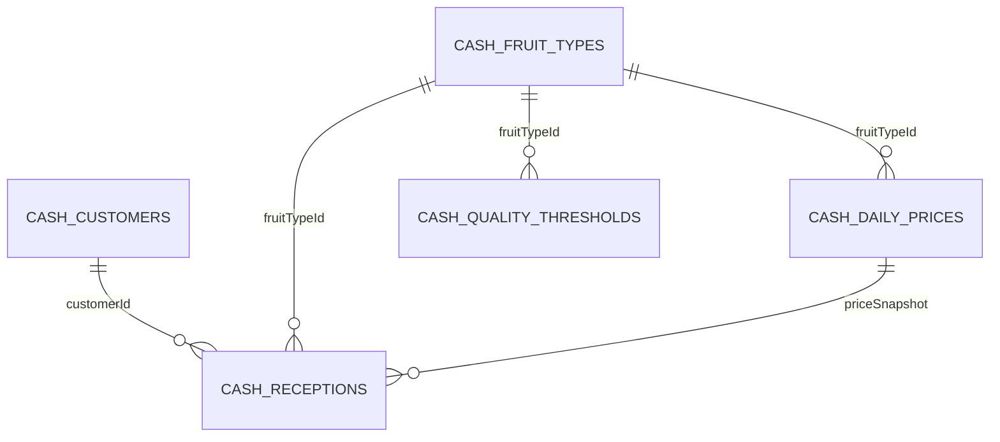

# Data Model: Cash POS Reception System

**Date**: 2025-11-05
**Feature**: Cash Point-of-Sale Reception System

## Overview

The Cash POS system uses a domain-isolated data model with all tables prefixed with `cash_` to ensure complete separation from the regular reception system. The model supports daily pricing, quality-based discounting, and comprehensive invoice generation.

## Entity Definitions

### 1. Cash Customer

**Purpose**: Represents individuals selling fruit for cash payment

**Table**: `cash_customers`

| Field | Type | Constraints | Description |
|-------|------|-------------|-------------|
| id | serial | PK | Unique identifier |
| name | varchar(160) | NOT NULL | Customer full name |
| national_id | varchar(32) | NOT NULL | Cédula (national ID) |
| created_at | timestamp | DEFAULT now(), NOT NULL | Record creation timestamp |
| created_by | varchar(64) | NOT NULL | User ID who created record |

**Validation Rules**:
- `name`: Minimum 2 characters, maximum 160 characters
- `national_id`: Format validation (XXX-XXXXXXX-X pattern recommended)
- `national_id`: Must be unique across all customers

**Relationships**:
- One-to-Many: Customer → Cash Receptions

---

### 2. Cash Fruit Type

**Purpose**: Catalog of fruit types supported in cash receptions

**Table**: `cash_fruit_types`

| Field | Type | Constraints | Description |
|-------|------|-------------|-------------|
| id | serial | PK | Unique identifier |
| code | varchar(32) | NOT NULL, UNIQUE | Short code (e.g., CAFE, CACAO, MIEL, COCOS) |
| name | varchar(64) | NOT NULL | Display name (e.g., Café, Cacao, Miel, Cocos) |
| enabled | boolean | DEFAULT true, NOT NULL | Whether fruit type is active |
| created_at | timestamp | DEFAULT now(), NOT NULL | Record creation timestamp |

**Initial Data**:
```sql
INSERT INTO cash_fruit_types (code, name) VALUES
('CAFE', 'Café'),
('CACAO', 'Cacao'),
('MIEL', 'Miel'),
('COCOS', 'Cocos');
```

**Validation Rules**:
- `code`: Must be unique, typically uppercase
- `name`: Minimum 2 characters, maximum 64 characters
- `enabled=false`: Fruit type hidden from forms, but historical data remains accessible

**Relationships**:
- One-to-Many: Fruit Type → Daily Prices
- One-to-Many: Fruit Type → Quality Thresholds
- One-to-Many: Fruit Type → Cash Receptions

---

### 3. Daily Price

**Purpose**: Historical record of per-kg prices set by admins for specific dates

**Table**: `cash_daily_prices`

| Field | Type | Constraints | Description |
|-------|------|-------------|-------------|
| id | serial | PK | Unique identifier |
| fruit_type_id | integer | FK → cash_fruit_types.id, NOT NULL | Associated fruit type |
| price_date | date | NOT NULL | Date price applies to |
| price_per_kg | numeric(12,4) | NOT NULL | Price per kilogram |
| created_at | timestamp | DEFAULT now(), NOT NULL | Record creation timestamp |
| created_by | varchar(64) | NOT NULL | User ID who set price |
| active | boolean | DEFAULT true, NOT NULL | Whether price is active |

**Validation Rules**:
- `price_per_kg`: Must be positive (> 0)
- `price_date`: Cannot be future date
- Multiple prices per date allowed (latest active takes precedence)

**Lookup Logic**:
```sql
-- Find active price for (fruitType, date)
SELECT pricePerKg
FROM cash_daily_prices
WHERE fruitTypeId = ? AND priceDate = ? AND active = true
ORDER BY createdAt DESC
LIMIT 1;
```

**State Transitions**:
- `active=true` → `active=false`: Price deactivated, historical record preserved
- `active=false` → `active=true`: Price reactivated

**Relationships**:
- Many-to-One: Fruit Type ← Daily Prices
- One-to-Many: Daily Prices → Cash Receptions (via price snapshot)

---

### 4. Quality Threshold

**Purpose**: Configurable quality standards per fruit type for discount calculation

**Table**: `cash_quality_thresholds`

| Field | Type | Constraints | Description |
|-------|------|-------------|-------------|
| id | serial | PK | Unique identifier |
| fruit_type_id | integer | FK → cash_fruit_types.id, NOT NULL | Associated fruit type |
| metric | varchar(32) | NOT NULL | Metric name (humedad, moho, violetas) |
| threshold_percent | numeric(5,2) | NOT NULL | Threshold percentage (e.g., 30.00) |
| enabled | boolean | DEFAULT true, NOT NULL | Whether metric is active |
| created_at | timestamp | DEFAULT now(), NOT NULL | Record creation timestamp |

**Validation Rules**:
- `metric`: Must be from approved list (humedad, moho, violetas)
- `threshold_percent`: Range 0.00 to 100.00
- Unique per (fruitType, metric): Cannot have duplicate thresholds for same fruit and metric

**Initial Data** (per fruit type):
```sql
-- Café thresholds (example)
INSERT INTO cash_quality_thresholds (fruitTypeId, metric, thresholdPercent) VALUES
(1, 'humedad', 30.00),
(1, 'moho', 10.00),
(1, 'violetas', 5.00);
```

**State Transitions**:
- `enabled=true` → `enabled=false`: Metric excluded from discount calculations
- `enabled=false` → `enabled=true`: Metric reactivated for future receptions

**Discount Calculation Logic**:
```javascript
for each enabled threshold:
  excess = Math.max(0, measuredValue - thresholdPercent)
  totalExcess += excess
combinedDiscountPercent = Math.min(totalExcess, 100)
```

**Relationships**:
- Many-to-One: Fruit Type ← Quality Thresholds
- Cash Receptions reference thresholds indirectly (via fruit type and metric names)

---

### 5. Cash Reception (Core Transaction)

**Purpose**: Core transaction record representing a single fruit reception

**Table**: `cash_receptions`

| Field | Type | Constraints | Description |
|-------|------|-------------|-------------|
| id | serial | PK | Unique identifier |
| fruit_type_id | integer | FK → cash_fruit_types.id, NOT NULL | Fruit type received |
| customer_id | integer | FK → cash_customers.id, NOT NULL | Customer selling fruit |
| reception_date | timestamp | DEFAULT now(), NOT NULL | Date/time of reception |
| containers_count | integer | DEFAULT 0, NOT NULL | Number of containers |
| total_weight_kg_original | numeric(12,3) | NOT NULL | Weight before discounts |
| price_per_kg_snapshot | numeric(12,4) | NOT NULL | Price at time of reception |
| calidad_humedad | numeric(5,2) | NULL | Humidity percentage |
| calidad_moho | numeric(5,2) | NULL | Moho percentage |
| calidad_violetas | numeric(5,2) | NULL | Violetas percentage |
| discount_percent_total | numeric(6,3) | DEFAULT 0, NOT NULL | Combined discount percentage |
| discount_weight_kg | numeric(12,3) | DEFAULT 0, NOT NULL | Weight deducted due to discounts |
| total_weight_kg_final | numeric(12,3) | NOT NULL | Weight after discounts |
| gross_amount | numeric(14,4) | NOT NULL | originalWeight × priceSnapshot |
| net_amount | numeric(14,4) | NOT NULL | finalWeight × priceSnapshot |
| discount_breakdown | jsonb | DEFAULT '{}', NOT NULL | Per-metric discount details |
| created_at | timestamp | DEFAULT now(), NOT NULL | Record creation timestamp |
| created_by | varchar(64) | NOT NULL | User ID who created reception |

**Validation Rules**:
- `total_weight_kg_original`: Must be positive (> 0)
- `total_weight_kg_final`: Must be positive (> 0)
- `price_per_kg_snapshot`: Must be positive (> 0)
- Quality fields: Range 0.00 to 100.00 if provided
- `discount_breakdown`: Valid JSON with structure defined below

**Computed Fields** (derived from inputs):
```javascript
// Calculated at creation/editing
finalWeight = originalWeight - discountWeight
grossAmount = originalWeight × priceSnapshot
netAmount = finalWeight × priceSnapshot
```

**Discount Breakdown JSON Structure**:
```json
{
  "humedad": {
    "threshold": 30.00,
    "value": 40.00,
    "percentApplied": 10.00,
    "weightKg": 20.000
  },
  "moho": {
    "threshold": 10.00,
    "value": 8.00,
    "percentApplied": 0.00,
    "weightKg": 0.000
  },
  "violetas": {
    "threshold": 5.00,
    "value": 7.00,
    "percentApplied": 2.00,
    "weightKg": 4.000
  }
}
```

**Discount Calculation Formula**:
```javascript
// Excess-over-threshold calculation
let totalExcessPercent = 0;
const breakdown = {};

for each threshold (humedad, moho, violetas):
  const value = measuredValue || 0;
  const excess = Math.max(0, value - thresholdPercent);
  totalExcessPercent += excess;

  breakdown[metric] = {
    threshold: thresholdPercent,
    value: measuredValue || null,
    percentApplied: excess,
    weightKg: 0 // calculated after clamping
  };

// Clamp total discount to 100%
totalExcessPercent = Math.min(totalExcessPercent, 100);

// Calculate discount weight
const discountWeight = originalWeight × (totalExcessPercent / 100);
const finalWeight = originalWeight - discountWeight;

// Distribute weight proportionally
let totalExcess = sum of all percentApplied values;
for each metric in breakdown:
  const share = totalExcess > 0 ? breakdown[metric].percentApplied / totalExcess : 0;
  breakdown[metric].weightKg = discountWeight × share;
```

**State Transitions**:
- Creation: All fields populated, price snapshot taken
- Editing: Recalculate discounts if weight/quality changed, price snapshot preserved

**Relationships**:
- Many-to-One: Fruit Type ← Cash Receptions
- Many-to-One: Customer ← Cash Receptions
- References: Daily Prices (via price snapshot, not FK constraint)

---

## Entity Relationships



### Foreign Key Constraints

```sql
-- Daily Prices → Fruit Types
ALTER TABLE cash_daily_prices
  ADD CONSTRAINT fk_daily_prices_fruit_type
  FOREIGN KEY (fruitTypeId) REFERENCES cash_fruit_types(id);

-- Quality Thresholds → Fruit Types
ALTER TABLE cash_quality_thresholds
  ADD CONSTRAINT fk_quality_thresholds_fruit_type
  FOREIGN KEY (fruitTypeId) REFERENCES cash_fruit_types(id);

-- Receptions → Fruit Types
ALTER TABLE cash_receptions
  ADD CONSTRAINT fk_receptions_fruit_type
  FOREIGN KEY (fruitTypeId) REFERENCES cash_fruit_types(id);

-- Receptions → Customers
ALTER TABLE cash_receptions
  ADD CONSTRAINT fk_receptions_customer
  FOREIGN KEY (customerId) REFERENCES cash_customers(id);
```

---

## Indexing Strategy

```sql
-- Primary keys (automatically created)
-- CREATE UNIQUE INDEX cash_customers_id_pkey ON cash_customers(id);

-- Foreign key indexes (performance)
CREATE INDEX idx_daily_prices_fruit_date ON cash_daily_prices(fruitTypeId, priceDate, active);
CREATE INDEX idx_daily_prices_date ON cash_daily_prices(priceDate);

CREATE INDEX idx_quality_thresholds_fruit ON cash_quality_thresholds(fruitTypeId);
CREATE INDEX idx_quality_thresholds_metric ON cash_quality_thresholds(metric);

CREATE INDEX idx_receptions_date ON cash_receptions(receptionDate);
CREATE INDEX idx_receptions_customer ON cash_receptions(customerId);
CREATE INDEX idx_receptions_fruit ON cash_receptions(fruitTypeId);

-- Unique constraints
CREATE UNIQUE INDEX idx_fruit_types_code ON cash_fruit_types(code);
CREATE UNIQUE INDEX idx_quality_thresholds_unique ON cash_quality_thresholds(fruitTypeId, metric);
```

---

## Data Integrity Rules

### 1. Price Snapshot Integrity
**Rule**: `price_per_kg_snapshot` is immutable after creation

**Implementation**:
- No UPDATE allowed on `price_per_kg_snapshot` field
- If price needs to change, create new reception
- Audit: Store `createdBy` to track who created reception

### 2. Discount Calculation Consistency
**Rule**: Computed fields (discount_weight, final_weight, amounts) must be consistent with input fields

**Implementation**:
- Validation trigger checks: `finalWeight = originalWeight - discountWeight`
- Validation trigger checks: `grossAmount = originalWeight × priceSnapshot`
- Validation trigger checks: `netAmount = finalWeight × priceSnapshot`

### 3. Discount Breakdown Integrity
**Rule**: Discount breakdown JSON must match calculated values

**Implementation**:
- Validation trigger sums breakdown weights and compares to `discount_weight_kg`
- Allow small floating-point tolerance (0.001 kg)

---

## Audit & Change Tracking

All tables include:
- `created_at`: Timestamp of record creation
- `created_by`: User ID who created record

**Future Enhancement** (not in initial scope):
- Add `updated_at` and `updated_by` for modification tracking
- Add soft delete (`deleted_at`, `deleted_by`) for data recovery

---

## Seed Data Requirements

### Fruit Types
```sql
INSERT INTO cash_fruit_types (code, name) VALUES
('CAFE', 'Café'),
('CACAO', 'Cacao'),
('MIEL', 'Miel'),
('COCOS', 'Cocos');
```

### Quality Thresholds (Example for Café)
```sql
INSERT INTO cash_quality_thresholds (fruitTypeId, metric, thresholdPercent) VALUES
(1, 'humedad', 30.00),
(1, 'moho', 10.00),
(1, 'violetas', 5.00);
```

### Test Customers (Example)
```sql
INSERT INTO cash_customers (name, nationalId, createdBy) VALUES
('Juan Pérez', '001-0123456-7', 'admin-user-id'),
('María García', '001-0987654-3', 'admin-user-id');
```

---

## Migration Strategy

### Phase 1: Create Tables
```sql
-- Create tables in dependency order (customers, fruit types first)
-- Add foreign key constraints
-- Create indexes
```

### Phase 2: Seed Initial Data
```sql
-- Insert fruit types
-- Insert default quality thresholds
```

### Phase 3: Create RLS Policies
```sql
-- Add RLS policies for all tables
-- Test policies with different roles
```

### Phase 4: Test Data
```sql
-- Create test customers
-- Set test daily prices
-- Create sample receptions
```

---

## Summary

The Cash POS data model provides:
- **Complete isolation** from regular reception system via `cash_` prefix
- **Immutable price snapshots** ensuring financial integrity
- **Flexible quality thresholds** supporting multiple metrics per fruit type
- **Transparent discount calculations** with detailed breakdown storage
- **Comprehensive audit trail** for all transactions

Total entities: 5
Total tables: 5
Total relationships: 5 (all Many-to-One)
